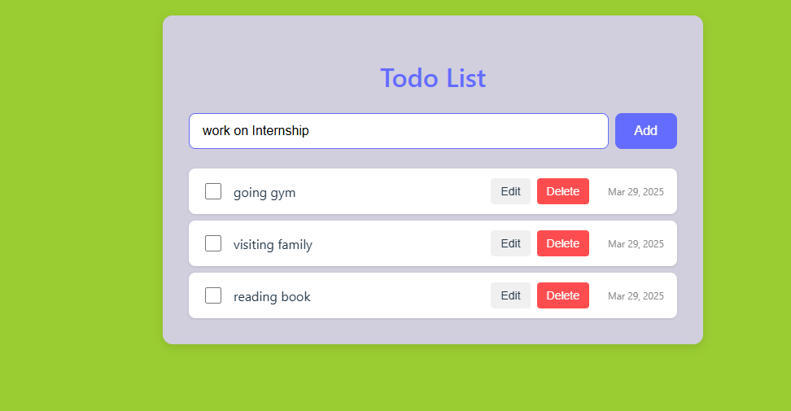
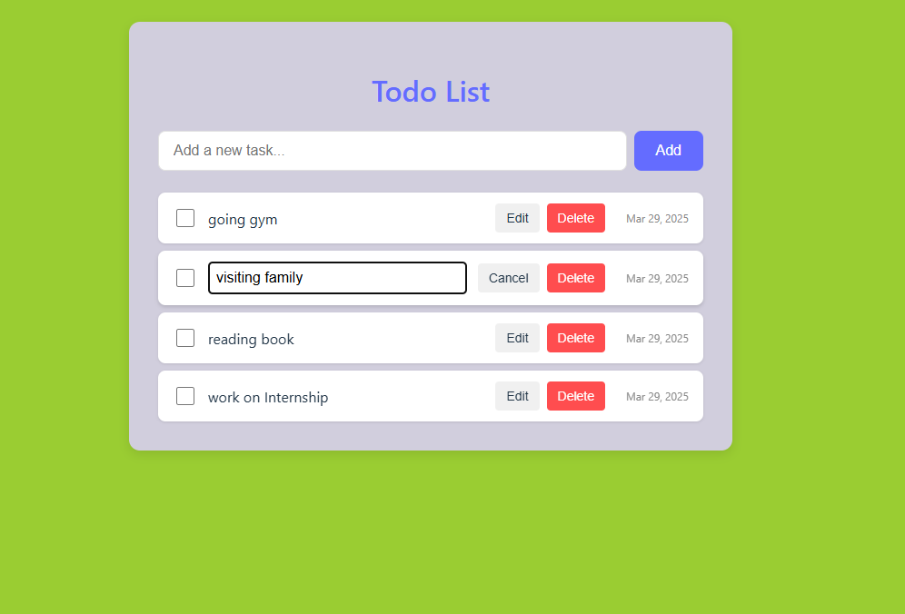
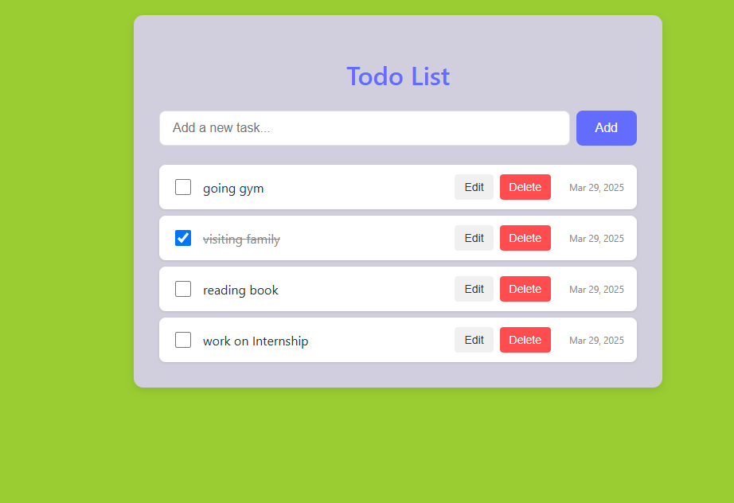

# Todo List Application

A simple, responsive Todo List application built with React and TypeScript, featuring persistent storage using localStorage

 ## Features

 -Add new tasks
 -Edit existing tasks
 -Mark tasks as complete/incomplete
 -Delete tasks
 -Persistent storage using localStorage
 -Clean and modern UI
 -Fully responsive design
 -Keyboard-friendly operations

 ## Technologies Used

 -React 18
 -TypeScript
 -CSS Modules for styling
 -Font Awesome for icons
 -localStorage for data persistence

## Add task

 

## Edit task

 

## Completed Task



## How to Run

1. Clone this repository
   -git clone https://github.com/ablove/react-todo-ts.git

2. Navigate to the project directory
   -cd react-todo-ts

3. Install dependencies
   -npm install

4. Start the development server
   -npm run dev

5. Open your browser and visit http://localhost:5173

## Usage Guide

Adding Tasks
-Type your task in the input field
-Press Enter or click the "+ Add" button

Managing Tasks
-Complete: Click the checkbox
-Edit: Click the edit button or double-click the task you want to edit
-Delete: Click the delete button

## Project Structure

```
react-todo-ts/
├── src/                    # Application source code
│   ├── components/         # React components
│   │   ├── AddTodo.tsx     # Component for adding tasks
│   │   ├── TodoItem.tsx    # Component for individual tasks
│   │   └── TodoList.tsx    # Component for listing tasks
│   ├── interfaces/         # TypeScript interfaces
│   │   └── Todo.ts         # Interface for task objects
│   ├── styles/             # CSS Modules for styling
│   │   ├── AddTodo.css     # Styling for AddTodo component
│   │   ├── App.css         # Main app styling
│   │   ├── TodoItem.css    # Styling for TodoItem component
│   │   └── TodoList.css    # Styling for TodoList component
│   ├── App.tsx             # Main application component
│   └── main.tsx            # Application entry point
├── public/                 # Public static assets
├── package.json            # Project configuration and dependencies
├── tsconfig.json           # TypeScript configuration
├── vite.config.ts          # Vite build configuration
└── README.md               # Project documentation
```
